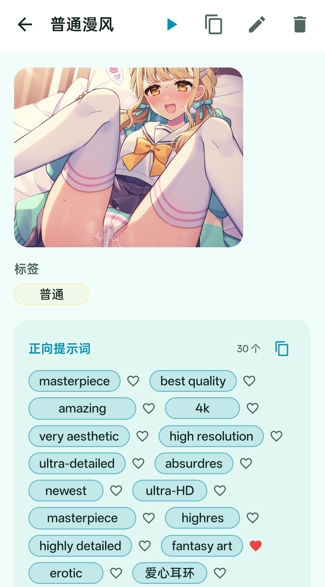
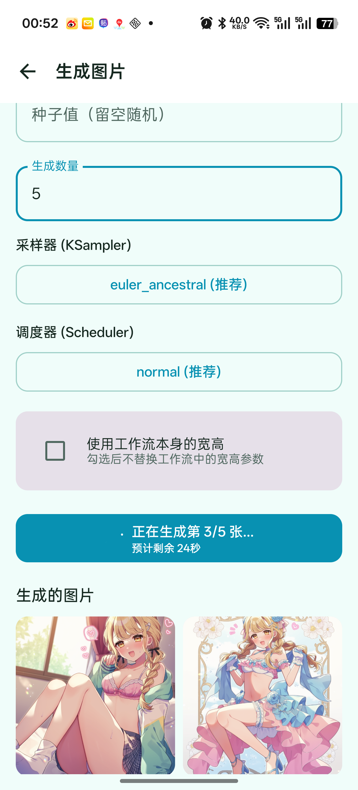
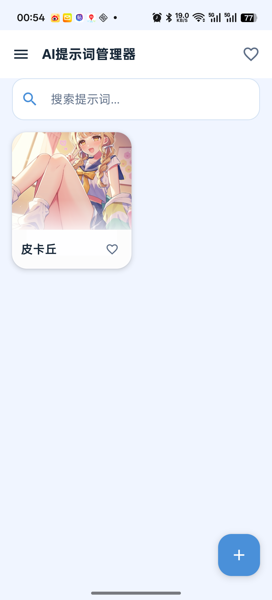
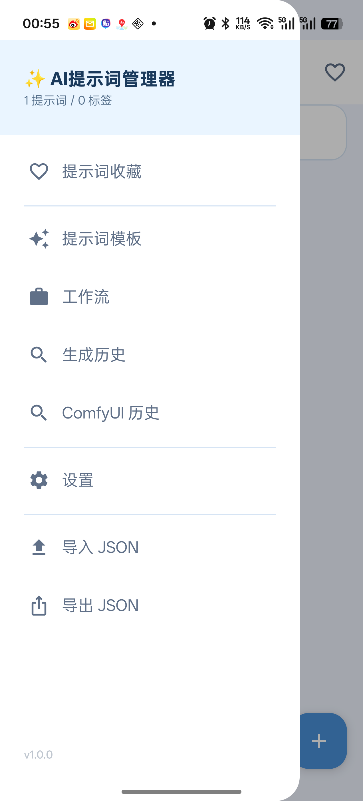
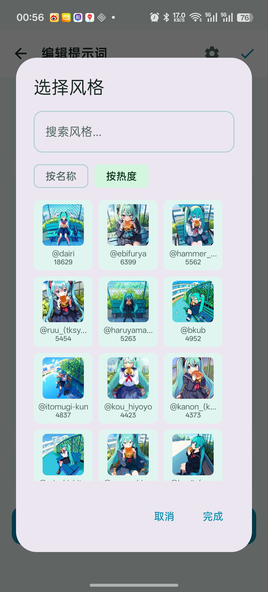

# AnimaForge

<div align="center">

**🎨 Anima 文生图模型的移动端 ComfyUI 提示词工作站**

[中文](#中文) | [English](#english) | [日本語](#日本語)

</div>

---

## 📱 截图 Preview / プレビュー

<div align="center">

| 详情 Detail | 生成 Generate | 主页 Home | 侧边栏 Drawer | 风格 Style |
|:---:|:---:|:---:|:---:|:---:|
|  |  |  |  |  |

</div>

---

## 中文

### 简介

**AnimaForge** 是一款专为 [Anima](https://huggingface.co/circlestone-labs/Anima) 文生图模型设计的 Android 提示词管理工具，深度集成 ComfyUI 工作流，让你在手机上高效管理、创作和生成 AI 图片。风格数据来自 [Anima Artist Gallery](https://anima.mooshieblob.com/)。

### 核心功能

- **提示词管理** — 本地数据库存储正向/负向/风格提示词，支持标签分类、搜索筛选、收藏置顶
- **ComfyUI 集成** — 一键连接 ComfyUI 服务器，提交生成任务，实时 WebSocket 进度与历史
- **工作流智能参数替换** — 自动识别 UNETLoader、Power Lora Loader、KSamplerAdvanced 等节点，替换提示词/种子/采样器/基础模型/LoRA 配置
- **模型与 LoRA 配置** — 每套提示词独立绑定额模型和 LoRA 列表，支持开关/强度调节/添加删除
- **SDXLEmptyLatentSizePicker+ 支持** — 分辨率下拉框 26 档预设，自动检测工作流类型切换 UI
- **风格库** — 内置上千位画师风格数据，支持搜索、预览、一键添加
- **画师收藏夹** — 收藏常⽤画师，网格卡片展示，长按预览作品
- **视频预览** — Media3 ExoPlayer 集成，图生视频结果播放
- **多主题** — 樱花粉 / 经典蓝 / 葱绿 / 暗夜星辰 / 赛博极光 五套主题
- **工作流管理** — 保存和管理 ComfyUI 工作流 JSON（含文生图/图生视频 Demo）
- **数据安全** — SQLite + Room 本地存储，支持 JSON 导入导出和自动备份

### 技术栈

- **语言**: Kotlin 100%
- **UI**: Jetpack Compose (Material 3)
- **架构**: MVVM (ViewModel + StateFlow)
- **数据库**: Room (SQLite) + DataStore Preferences
- **网络**: OkHttp + Retrofit
- **图片**: Coil
- **视频**: Media3 ExoPlayer
- **最低支持**: Android 8.0 (API 26)

### 致谢

本应用的风格标签数据来源于 **[Anima Artist Gallery](https://anima.mooshieblob.com/)**。感谢 [@mooshieblob](https://anima.mooshieblob.com/) 精心整理的海量画师风格数据集。

Anima 模型由 **[circlestone-labs](https://huggingface.co/circlestone-labs/Anima)** 开发并开源在 HuggingFace，是一款卓越的动漫风格文生图模型。

---

## English

### Introduction

**AnimaForge** is an Android prompt management tool purpose-built for the [Anima](https://huggingface.co/circlestone-labs/Anima) text-to-image model, with deep ComfyUI workflow integration. Manage, craft, and generate AI images right from your phone. Style data from [Anima Artist Gallery](https://anima.mooshieblob.com/).

### Core Features

- **Prompt Management** — Local SQLite storage for positive/negative/style prompts with tag categorization, search, favorites, and pinning
- **ComfyUI Integration** — One-tap connection to ComfyUI servers with real-time WebSocket progress & history
- **Smart Workflow Param Replacement** — Auto-detects UNETLoader, Power Lora Loader, KSamplerAdvanced nodes; replaces prompt/seed/sampler/base model/LoRA configs
- **Model & LoRA Config** — Per-prompt base model selection and LoRA list with toggle/strength/add/remove
- **SDXLEmptyLatentSizePicker+ Support** — 26 preset resolution dropdown, auto UI switching based on workflow type
- **Artist Style Library** — 1000+ artist style tags with search, preview, and one-tap addition
- **Artist Favorites** — Bookmark favorite artists, grid card display, long-press to preview works
- **Video Preview** — Media3 ExoPlayer integration for video generation results
- **Multi-Theme** — Sakura Pink / Classic Blue / Mint Green / Dark Star / Cyber Neon
- **Workflow Manager** — Save and manage ComfyUI workflow JSON presets (incl. text2img & img2video demos)
- **Data Safety** — SQLite + Room local storage, JSON import/export, automatic backups

### Tech Stack

- **Language**: Kotlin 100%
- **UI**: Jetpack Compose (Material 3)
- **Architecture**: MVVM (ViewModel + StateFlow)
- **Database**: Room (SQLite) + DataStore Preferences
- **Network**: OkHttp + Retrofit
- **Image Loading**: Coil
- **Video**: Media3 ExoPlayer
- **Min SDK**: Android 8.0 (API 26)

### Acknowledgments

Artist style data is sourced from the **[Anima Artist Gallery](https://anima.mooshieblob.com/)**. Huge thanks to [@mooshieblob](https://anima.mooshieblob.com/) for the meticulously curated artist style dataset.

The Anima model is developed and open-sourced by **[circlestone-labs](https://huggingface.co/circlestone-labs/Anima)** on HuggingFace — an outstanding anime-style text-to-image model.

---

## 日本語

### 概要

**AnimaForge** は、[Anima](https://huggingface.co/circlestone-labs/Anima) テキスト画像生成モデル専用の Android プロンプト管理ツールです。ComfyUI ワークフローと深く統合し、スマートフォンから AI 画像の管理・作成・生成を効率的に行えます。スタイルデータは [Anima Artist Gallery](https://anima.mooshieblob.com/) より。

### 主な機能

- **プロンプト管理** — ポジティブ/ネガティブ/スタイルのプロンプトをローカル SQLite に保存。タグ分類、検索フィルター、お気に入り登録、ピン留めに対応
- **ComfyUI 連携** — ワンタップで ComfyUI サーバーに接続し、WebSocket でリアルタイム進捗確認
- **ワークフローパラメータ自動置換** — UNETLoader, Power Lora Loader, KSamplerAdvanced ノードを自動検出し、パラメータをスマートに置換
- **モデル & LoRA 設定** — プロンプトごとにベースモデルと LoRA リストを紐付け、ON/OFF/強度調整/追加削除が可能
- **SDXLEmptyLatentSizePicker+ 対応** — 26段階プリセット解像度ドロップダウン、ワークフロー種別に応じた自動UI切替
- **アーティストスタイルライブラリ** — 1000以上のタグを搭載。検索、プレビュー、ワンタップ追加
- **お気に入りアーティスト** — グリッドカード表示、長押しプレビュー
- **動画プレビュー** — Media3 ExoPlayer 統合で生成動画を再生
- **マルチテーマ** — 桜ピンク / クラシックブルー / ミントグリーン / ダークスター / サイバーネオン
- **ワークフロー管理** — ComfyUI ワークフロー JSON を保存・管理（文生図 & 図生動画デモ付き）
- **データ保護** — SQLite + Room によるローカル保存、JSON インポート/エクスポート、自動バックアップ

### 技術スタック

- **言語**: Kotlin 100%
- **UI**: Jetpack Compose (Material 3)
- **アーキテクチャ**: MVVM (ViewModel + StateFlow)
- **データベース**: Room (SQLite) + DataStore Preferences
- **ネットワーク**: OkHttp + Retrofit
- **画像読込**: Coil
- **最小 SDK**: Android 8.0 (API 26)

### 謝辞

本アプリのスタイルタグデータは **[Anima Artist Gallery](https://anima.mooshieblob.com/)** から提供されています。[@mooshieblob](https://anima.mooshieblob.com/) による膨大なアーティストスタイルデータセットに心より感謝します。

Anima モデルは **[circlestone-labs](https://huggingface.co/circlestone-labs/Anima)** によって開発・オープンソース化された、優れたアニメスタイルのテキスト画像生成モデルです。

---

## 🚀 快速开始 Quick Start / クイックスタート

1. Clone 项目 / Clone repository / リポジトリをクローン
```bash
git clone https://github.com/yourusername/AnimaForge.git
```
2. Android Studio 打开项目 / Open in Android Studio / Android Studio で開く
3. Sync Gradle → Run on device

ComfyUI 服务端需自行部署。请在设置中填写你的 ComfyUI 服务器地址。

---

<div align="center">
Made with ❤️ for the AI art community
</div>
